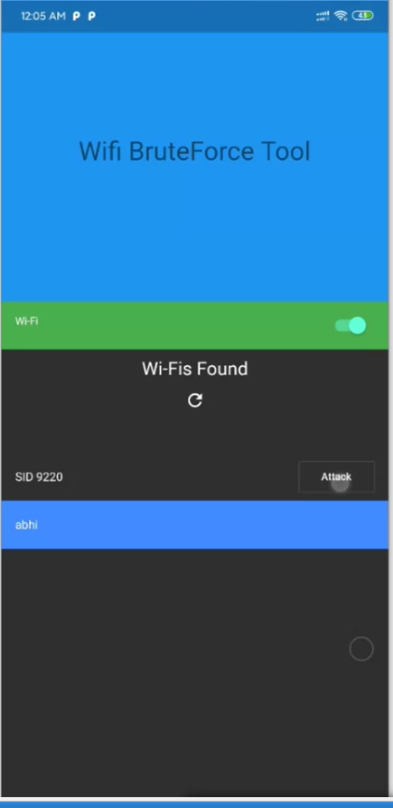
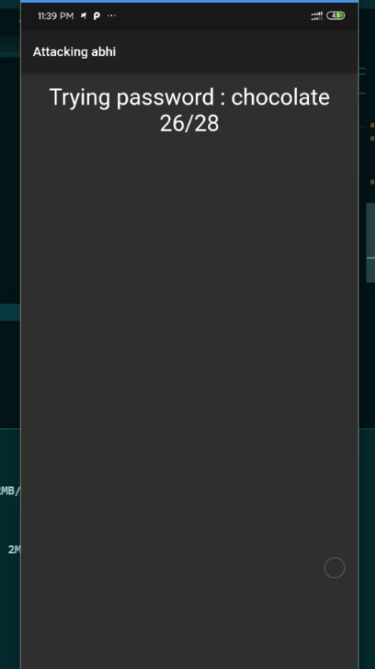

# Flutter wpa/wep bruteforce tool

## Tool made in flutter to iterate the wifi connection until it connect.(Wifi hacking tool)

## Just replace with your passwords in constants.dart and start attacking

## Made by <a href="https://youtube.com/sidtube"> Sidtube </a> for educational purpose video on channel .

## Note: IF it ask for permission time and again then goto app settings and directly allow permission for the wifi .
 
 

